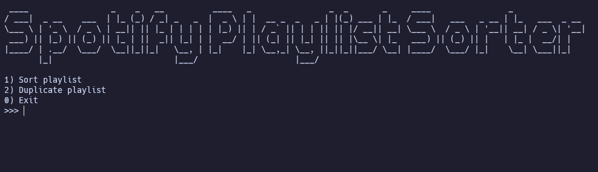

# Spotify playlist sorter



This script sorts your spotify playlist.

Sorting of the playlist follows these rules:

1. Duplicate tracks will be removed.
2. Tracks are sorted into groups of albums, that are ordered in the manner of the album.
3. Albums are grouped by artist and release date. (Artist is determined from the album rather than the track)
4. Artist groups are sorted depending on the first tracks appearance date on the playlist.

I haven't created a executable for linux or macOS.
You can still use the python script as is if you would like.

## Automation

To automate this process, you may use any utility that you seem fit.
The script has arguments that can so that it can automatically sort a playlist.

```bash
python ./src/main.py --sort 'playlist url here'
```

It executes the sorting with console output.
Recommended tools for the automation process is pm2.

For some guidance on how to use pm2, see [this](https://pm2.keymetrics.io/docs/usage/quick-start/)

## How to use

### Requirements

- Spotify API credentials (SPOTIPY_CLIENT_ID and SPOTIPY_CLIENT_SECRET) 
  - Get these by creating an application in the [spotify developer portal](https://developer.spotify.com/dashboard/applications)
  - Set the Redirect URI to http://localhost:8080
- Python 3
- Pip dependencies in the requirements.txt file

### Get started

Create a config.json file where the executable is.  
Insert the spotify client id and secret like this:

```json
{
  "SPOTIPY_CLIENT_ID": "INSERT CLIENT ID HERE",
  "SPOTIPY_CLIENT_SECRET": "INSERT CLIENT SECRET HERE"
}
```

Install dependencies by running this command  
<code>pip install -r requirements.txt</code>

Start the script by running  
<code>python ./src/main.py</code>

---

There is an option to clone an existing playlist. This can be used to test the script before applying any permanent sorting to your original playlist.